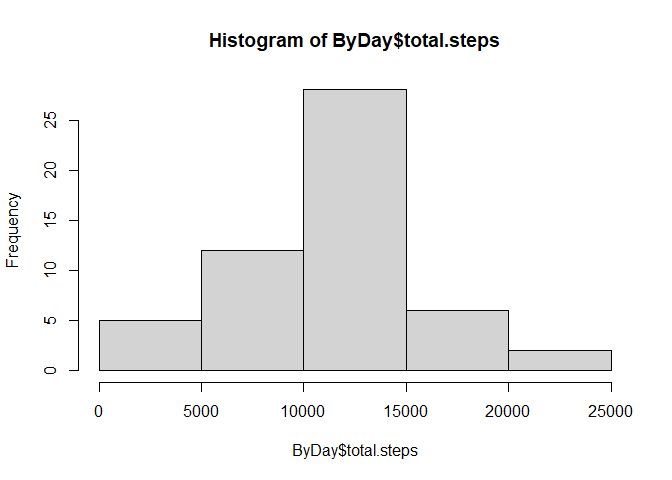
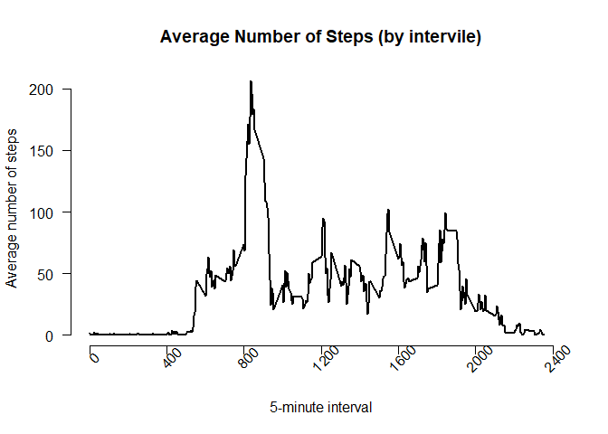
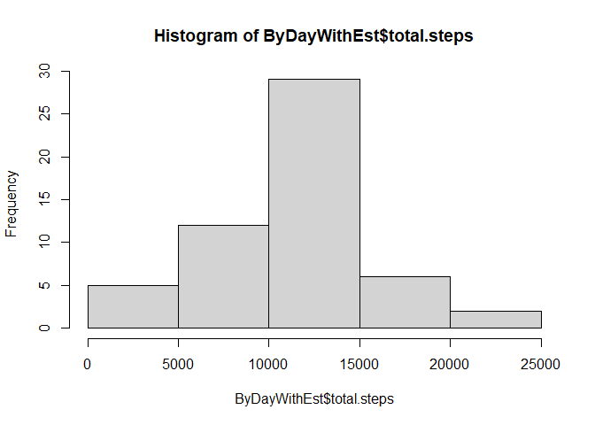
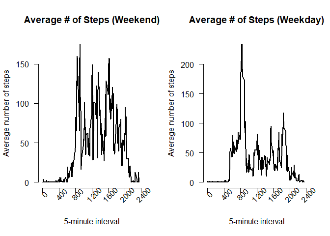

### 1. Code for reading in the dataset and/or processing the data
In this section we will clear the environment of any data.  Load necessary libraries  Then verify/ created that the directory C:\coursera\ReproducibleResearch\Week2.  Download and unzip a fresh copy of the data.

```r
# this is not needed but will clear out old variables
  rm(list= ls())
  # Load Libraries
  	library(dplyr)
```

```
## 
## Attaching package: 'dplyr'
```

```
## The following objects are masked from 'package:stats':
## 
##     filter, lag
```

```
## The following objects are masked from 'package:base':
## 
##     intersect, setdiff, setequal, union
```

```r
  	library(ggplot2)
  #Prepare to download file
  	dataFileZip <- "repdata%2Fdata%2Factivity.zip"
  	url <- "https://d396qusza40orc.cloudfront.net/repdata%2Fdata%2Factivity.zip"
  # Check for/make sub-directory "coursera"  
  	mainDir <- "C:"
  	subDir <- "coursera"
  	ifelse(!dir.exists(file.path(mainDir, subDir)), dir.create(file.path(mainDir,subDir)), FALSE)
```

```
## [1] FALSE
```

```r
  # Check for/make sub-directory "GetAndCleanData"  
  	mainDir <- paste(mainDir, "/", subDir,sep="")
  	subDir <- "ReproducibleResearch"
  	ifelse(!dir.exists(file.path(mainDir, subDir)), dir.create(file.path(mainDir, subDir)), FALSE)
```

```
## [1] FALSE
```

```r
  # Check for/make sub-directory "final"  
  	mainDir <- paste(mainDir, "/", subDir,sep="")
  	subDir <- "Week2"
  	ifelse(!dir.exists(file.path(mainDir, subDir)), dir.create(file.path(mainDir, subDir)), FALSE)
```

```
## [1] FALSE
```

```r
  # Check if file exists downlaod.
  	mainDir <- paste(mainDir, "/", subDir,sep="")
  	filename <- paste(mainDir, "/", dataFileZip,sep="")
  	if (!file.exists(filename)){download.file(url, filename, method="curl")}  
  #Unzip 
  	unzip(filename) 
  	# Remove unneeded variables
  	rm(list="dataFileZip","url","mainDir","subDir","filename")
  # read files
  	activity <- read.csv("activity.csv")
```

### 2. Histogram of the total number of steps taken each day 

```r
	ByDay <- activity%>%
		na.omit()%>% # removing the na data
		group_by(date)%>%
		summarise(total.steps=sum(steps))
```

```
## `summarise()` ungrouping output (override with `.groups` argument)
```

```r
	hist(ByDay$total.steps)
```

<!-- -->

### 3. Mean and median number of steps taken each day

```r
	StepsDayMean <- mean(ByDay$total.steps)
	StepsDaymedian <- median(ByDay$total.steps)
```

In this study the mean number of steps taken in a day was ` StepsDayMean`.  While `StepsDaymedian` is the median.

### 4. Time series plot of the average number of steps taken

```r
	avg_step <- aggregate(steps ~ interval, data = activity, mean, na.rm = TRUE)
	plot(avg_step$interval, avg_step$steps, type = "l", lwd = 2, 
	main = "Average Number of Steps (by intervile)", axes = FALSE,
	xlab = "5-minute interval", ylab = "Average number of steps",xlim=c(0,2400))
	#x axis
		xtick<-seq(0, 2400, by=400)    
		axis(side=1, at=xtick, labels = FALSE)
		text(x=xtick,  par("usr")[3], 
		labels = xtick, srt = 45, pos = 1, xpd = TRUE)
	#y axis
		axis(2, las = 1)  
```

<!-- -->

### 5. The 5-minute interval that, on average, contains the maximum number of steps

```r
	MaxAverageStep <- avg_step$interval[which.max(avg_step$steps)]
```

The time interval `MaxAverageStep` on average had the most steps.

### 6. Code to describe and show a strategy for imputing missing data
Where ever I found missing data I filled it with the average for that interville.

```r
	# Number of missing lines
		activityWithEst <- activity
	for (i in 1:nrow(activityWithEst)) {
		if (is.na(activityWithEst[i, "steps"]) == TRUE) {
			activityWithEst[i, "steps"]<-avg_step[i, "steps"]
		}
	}
```

### 7. Histogram of the total number of steps taken each day after missing values are imputed

```r
	ByDayWithEst <- activityWithEst%>%
		na.omit()%>% # removing the na data
		group_by(date)%>%
		summarise(total.steps=sum(steps))
```

```
## `summarise()` ungrouping output (override with `.groups` argument)
```

```r
	hist(ByDayWithEst$total.steps)
```

<!-- -->

### 8. Panel plot comparing the average number of steps taken per 5-minute interval across weekdays and weekends
Display 2 plots to compare the average steps on Weekdays vs. weekends.  To this I first added a column with a flag for weekend or weekday.  Next made 2 new tables based on that flag.  For each of those tables made new charts summarizing by 5 minute intervals.  Finally made the charts
that field 

```r
  activity$day <- ifelse(weekdays(as.Date(activity$date)) %in% c("Saturday", "Sunday"), "weekend", "weekday")
	weekend <-  activity %>% filter(day == "weekend")   
	weekday <-  activity %>% filter(day == "weekday")   
	Steps_weekend <- weekend %>%
		group_by(interval) %>%
		summarise(avg_steps = mean(steps, na.rm = TRUE)) 
```

```
## `summarise()` ungrouping output (override with `.groups` argument)
```

```r
	Steps_weekday <- weekday %>%
		group_by(interval) %>%
		summarise(avg_steps = mean(steps, na.rm = TRUE)) 
```

```
## `summarise()` ungrouping output (override with `.groups` argument)
```

```r
	# setup output
		par(mfrow=c(1,2))
	plot(Steps_weekend$interval, Steps_weekend$avg_steps, type = "l", lwd = 2, 
		main = "Average # of Steps (Weekend)", axes = FALSE,
		xlab = "5-minute interval", ylab = "Average number of steps",xlim=c(0,2400))
		#x axis
			xtick<-seq(0, 2400, by=400)    
			axis(side=1, at=xtick, labels = FALSE)
			text(x=xtick,  par("usr")[3], 
			labels = xtick, srt = 45, pos = 1, xpd = TRUE)
		#y axis
			axis(2, las = 1)  
	plot(Steps_weekday$interval, Steps_weekday$avg_steps, type = "l", lwd = 2, 
		main = "Average # of Steps (Weekday)", axes = FALSE,
		 xlab = "5-minute interval", ylab = "Average number of steps",xlim=c(0,2400))
		#x axis
			xtick<-seq(0, 2400, by=400)    
			axis(side=1, at=xtick, labels = FALSE)
			text(x=xtick,  par("usr")[3], 
			labels = xtick, srt = 45, pos = 1, xpd = TRUE)
		#y axis
			axis(2, las = 1)  
```

<!-- -->
